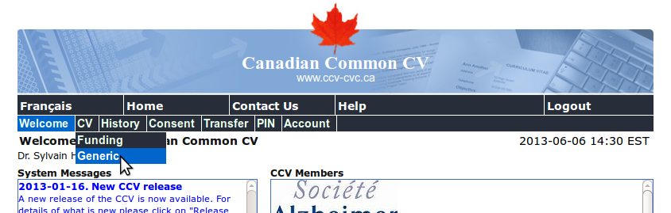
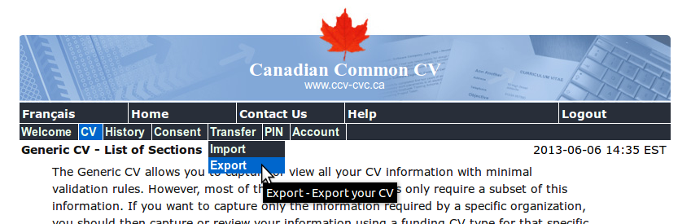

CCCVTK: The Canadian Common CV Toolkit
======================================

(User Manual, version 2013-06-06)

The [Canadian Common CV](https://ccv-cvc.ca/) (CCV) is a website that allows
Canadian researchers to manage data about their publications, research
grants, etc. in a uniform and centralized way. Most major funding agencies,
such as [NSERC](http://www.nserc.gc.ca/) or
[FRQNT](http://www.fqrnt.gouv.qc.ca/), now expect applicants to submit a CV
auto-generated from the data input in the CCV.

The "generic" version of the CCV is a large data structure whose contents
are independent of any requirements for funding agencies. Each instance of
the CCV for a particular agency is actually generated by fetching the parts
of the generic CV required by that agency. A nice feature of the generic CV
is that it can be exported as an XML file.

CCCVTK, the **Canadian Common CV Toolkit**, offers a set of tools that
allows a researcher to parse that file, and then query it in various ways.
Of particular interest is the ability to generate a LaTeX document based on
the information contained in this file, using only the fields chosen by the
user and presented in a completely configurable way (if you know LaTeX).
Hence, the data contained in the generic CV can be used to produce a
customized CV of any style and shape.

Table of contents                                                    {#toc}
-----------------

- [System requirements](#requirements)
- [Installing CCCVTK](#installing)
- [Exporting the CCV as an XML file](#exporting)
- [About the Author](#about)

System requirements                                         {#requirements}
-------------------

- [PHP](http://www.php.net/), a free programming language and interpreter.
  Any recent version (e.g. 5.3 and higher) should work.
- LaTeX, a document typesetting system. LaTeX is open source and versions
  exist for most operating systems; popular distributions include
  [MiKTeX](http://www.miktex.org/) for Windows systems and
  [TeXLive](http://www.texlive.org/) for Linux.

Installing CCCVTK                                             {#installing}
-----------------

The latest version of CCCVTK is available on GitHub at the following URL:

https://github.com/sylvainhalle/CCCVTK

To install CCCVTK, unzip the contents of the archive on GitHub into some
folder. Alternatively, you can clone the Git repository using the
instructions that appear at the top of the GitHub page.

Exporting the CCV as an XML file                               {#exporting}
--------------------------------

The first step in using CCCVTK is to obtain all the data you already input
into the CCV as an XML file (we assume this (time consuming) step is
already completed). This can easily be done through the CCV's
website.

First, login to the CCV as usual. Once logged in, locate and click on the
"Generic" item under the "CV" menu entry at the top of the screen.

Then, locate and click on the "Export" item under the "Transfer" menu entry
at the top of the screen.

You will be asked to Export the CV. Click on the "Export" button.

You will be asked to Save the resulting file to some folder. Save the
resulting file as `cv.xml` into the same folder where you installed CCCVTK.

Generating a CV from the XML file                             {#generating}
---------------------------------

Once you obtained the CCV data in XML form, you can use CCCVTK to generate
a customized LaTeX CV from the data contained in this file. Doing so is
simple. Open a terminal of command line window, and move to the folder where
you saved CCCVTK and the XML file from the previous step. On the command
line, type:

    php xml-to-latex.php > cv.tex

This command does two things. The first part (before the `>`) calls the PHP
interpreter and instructs it to execute the file `xml-to-latex.php`. This
file contains a program that reads the file `cv.xml`, parses its contents,
and outputs a LaTeX document that selects and formats various entries from
the file as a generic CV. The second part (after the `>`) tells the program
to send its output into a new file, called `cv.tex` (you can replace this
with any filename you wish, although it is recommended you keep the `.tex`
extension).

If you list the contents of the folder, you should now see that it contains
a new file, namely `cv.tex`. This file is a stand-alone document that can
be compiled with LaTeX. To do so, simply call on the command line:

    pdflatex cv.tex

You should see a lot of information sent to the screen. Once the program
stops, hopefully it should have produced a PDF file from the contents of
`cv.tex`, called `cv.pdf`. You may then open `cv.pdf` and be able to read a
clean, but rather plain version of a curriculum vitae based on information
fetched from `cv.tex` (itself built from `cv.xml` we just downloaded from
the CCV website).

So, why bother doing all this? We list a few advantages:

- The program `xml-to-latex.php` is a *program* that *generates* a CV from
  the website's contents. This means that every time you update information
  on the the website, you can re-download the XML file and re-generate the
  CV from the updated contents automatically.
- Since the CV is generated from a *program*, a lot of things can be
  computed dynamically from the XML file's contents. For example, the
  bundled version of `xml-to-latex.php` generates a table that summarizes
  the contents of the CV's various sections (number of courses taught,
  total of research funds, number of students supervised, etc.). This
  information is automatically created from the XML file and is recomputed
  on-the-fly if you update the XML.
- The program can be modified to your liking (if you know a bit of PHP
  programming). You can completely change the way publication info is
  displayed, use any LaTeX packages and commands you wish to change the CV's
  basic appearance, add new computations on the CV's content, filter data
  according to various criteria (e.g. all publications up to year XXXX) or
  remove complete section altogether. As a matter of fact, you can
  completely bypass `xml-to-latex.php` and write your own CV generator,
  fetching desired values from the CV using the [CCV classes](#api) that
  come with CCCVTK.

Using the CCCVTK API                                                 {#api}
--------------------

The file `xml-to-latex.php` is actually a PHP script that merely fetches
and formats data from a class called `CommonCV`.  This class is defined in
the companion file `common-cv.lib.php`, which can be included in any PHP
program independently of `xml-to-latex.php`. This section is intended for
PHP programmers and only provides brief information on how to use this
class. Please refer to the source code for more details.

To instantiate a common CV:

    $cv = new CommonCV("filename.xml");

This will read and parse `filename.xml` and return a new instance of the
CCV based on its contents.

From then on, various parts of the CV can be fetched through methods. Each
method returns data from the CCV as an associative array. For
example, to obtain the list of conference papers, call:

    $my_array = $cv->getConferencePapers();

Variable `$my_array` now contains an associative array where a key is a
paper ID, and its associated value is another array containing the various
fields pertaining to that paper. Hence, to iterate through all papers and
display their title, one might write:

    foreach ($my_array as $id => $contents)
    {
      $title = $contents["title"];
      echo "$title\n";
    }

Other sections of the CCV can be retrieved using other methods in a similar
way. Please refer to `xml-to-latex.php` or to `common-cv.lib.php` for
examples and more information.

About the Author                                                   {#about}
----------------

CCCVTK was developed by Sylvain Hallé, currently an Assistant Professor at
[Université du Québec à Chicoutimi, Canada](http://www.uqac.ca/) and head of
[LIF](http://lif.uqac.ca/), the Laboratory of Formal Computer Science
("Laboratoire d'informatique formelle"). Use CCCVTK at your own risk!

[Back to top](#toc)
